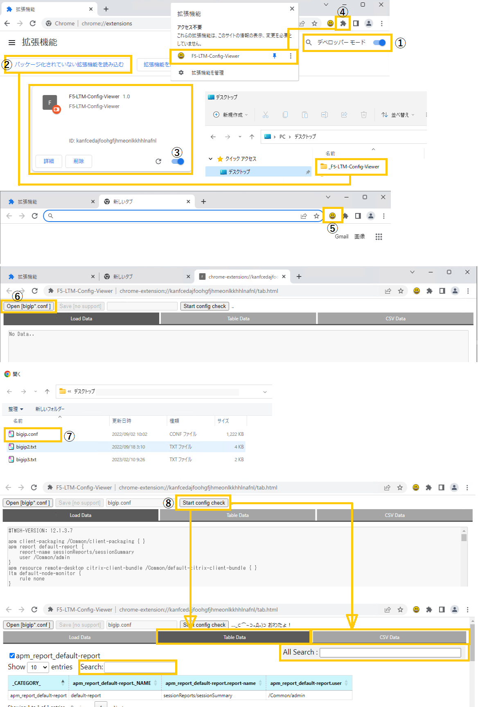

# F5 LTM Config viewer

Google Chrome browser extension tool.  
Parse F5's bigip.conf or bigip_base.conf and display it in a simple table.

### - How to use
1. Download and unzip this repository as a ZIP file.
2. Specify the folder in the Chrome browser extension tool.
  
